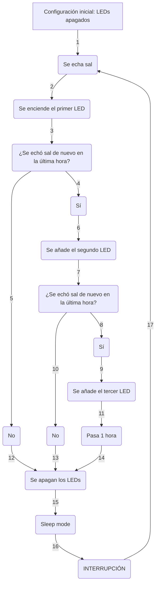

# pro-sensor-co2
Sensor de CO2 con indicador LED y conexión WiFi desarrollado por MediaLab UniOvi

# 
 PRO SENSOR CO2 - MEDIALAB UNIOVI 

## Sensor de CO2 para interiores con conectividad WiFi para almacenar la evolución de una sala en la nube e indicadores LED para ver de forma presencial el estado de la calidad del aire en tiempo real.

___

## Índice
- [Introducción](https://github.com/99danirmoya/Salero-MdN/tree/main?tab=readme-ov-file#introducci%C3%B3n)
- [Lista de componentes](https://github.com/99danirmoya/Salero-MdN/tree/main?tab=readme-ov-file#--lista-de-componentes-)
- [Esquemático](https://github.com/99danirmoya/Salero-MdN/tree/main?tab=readme-ov-file#esquem%C3%A1tico)
- [PCB personalizada](https://github.com/99danirmoya/Salero-MdN/tree/main?tab=readme-ov-file#pcb-personalizada)
- [Carcasa a medida](https://github.com/99danirmoya/Salero-MdN/tree/main?tab=readme-ov-file#carcasa-a-medida)
- [Modo de implementación](https://github.com/99danirmoya/Salero-MdN/tree/main?tab=readme-ov-file#-modo-de-implementaci%C3%B3n-)
- [Licencia](https://github.com/99danirmoya/Salero-MdN/tree/main?tab=readme-ov-file#-licencia-)
- [Contacto](https://github.com/99danirmoya/Salero-MdN/tree/main?tab=readme-ov-file#-contacto-)

___

## Introducción
Es un sensor que avisa con un mensaje de texto de la calidad del aire en un espacio interior.

El sensor dispone de una carcasa con tres zonas diferentes que se iluminan con distintos colores en función de las partículas de CO2 por millón de partículas.

Envía los valores tomados a una base de datos, y a través de una aplicación web, se puede monitorizar el estado de todas las estancias.

Además de la electrónica, el sensor consta de una carcasa de tres partes fácilmente montables: un difusor, un soporte de electrónica y un bastidor, al que puede acoplarse una peana que permite colocar el sensor sobre cualquier superficie plana.

___

## Modo de funcionamiento

> [!WARNING]
> El salero siempre está encendido dado su bajo consumo de batería. Si se retira la batería, no volverá a funcionar hasta que se le ponga la batería de nuevo, se conecte a un cargador, o ambas. Desde ese momento, se iniciará automáticamente

___

## 
  Lista de componentes 

| Componente | Unidades |
| ------------- | ------------- |
| Arduino NANO | 1 |
| [PCB](https://github.com/99danirmoya/Salero-MdN/blob/main/pcb) | 1 |
| Botón de inclinación | 1 |
| Botón | 1 |
| LED verde | 1 |
| LED amarillo | 1 |
| LED rojo | 1 |
| Resistencias 2K2 | 3 |
| Batería 18650 | 1 |
| Porta-batería | 1 |
| TP4056 | 1 |

___

## Esquemático

A continuación, se muestra el esquemático para consultar conexiones:

  
  
  <em>Esquemático del salero memorístico</em>

 

___

## PCB personalizada

En la carpeta [`Salero-MdN/tree/main/pcb`](https://github.com/99danirmoya/Salero-MdN/tree/main/pcb) se encuentran los archivos Gerber para su fabricación:

  

  <em>Vista posterior de la PCB</em>

 

  

  <em>Vista anterior de la PCB</em>

 

___

### 
 Flujograma 

___

## Carcasa a medida

En la carpeta [`Salero-MdN/tree/main/housing`](https://github.com/99danirmoya/Salero-MdN/tree/main/housing) se incluyen los tres archivos ".stl" que se muestran a continuación:

  

  <em>Dosificador</em>

 
  

  

  <em>Recipiente de sal</em>

 
  

  

  <em>Contenedor de electrónica</em>

 

> [!WARNING]
> Los modelos de las imágenes son experimentales y aún están siendo trabajados

___

## 
 Modo de implementación 

Toda la explicación del código de Arduino viene dada en el mismo, [`99danirmoya/Salero-MdN/tree/main/src/main.cpp`](https://github.com/99danirmoya/Salero-MdN/blob/main/src/main.cpp), en formato de comentarios al lado de cada línea

___

## 
 Licencia 

Este proyecto está licenciado bajo la [GPL-3.0 license](https://github.com/99danirmoya/turtle-bot-neo?tab=GPL-3.0-1-ov-file).

___

## 
 Contacto 

> [!IMPORTANT]
> Responderemos amablemente a dudas y leeremos sugerencias: 
> 
> Más información sobre nuestras actividades: 

  

 

_
 Autores: Simón, Andrea, César, Aida, Juan, Iván y Carlos :shipit: 
_
